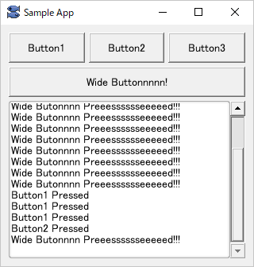

# KWidgets

KWidgetsは[吉里吉里Z](https://krkrz.github.io/)で
GUIアプリを構築するためのライブラリです。

吉里吉里ZのADVアプリケーションであるKAGとの互換性はありません。

吉里吉里Zで使うための画像データを作成する用途に向いています。

吉里吉里Z用の各種Windowsプラグインと組み合わせることで、
汎用的なGUIアプリケーションを作る目的にも利用できます。

## コードの凡例

KWidgetsを使ったアプリの凡例は以下のようになります。

サンプルアプリソースコード

	class SampleWindow extends KWindow
	{
		// コンストラクタ
		function SampleWindow() {
			super.KWindow(%[ name: "sample" ]);
	
			caption = "Sample App";
	
			// ルートウィジェットの下にグリッドレイアウトを作る。
			primaryWidget.add(new KGridLayout(this,
				%[ 
					// ウィジェットを識別するための名前を設定
					name: "rootGrid",
					// ウィジェットの見た目を定義するスタイルを設定
					style: %[
						// マージンとスペースを設定
						margin: 10,
						space: 5,
						// 子孫ウィジェットのクラスにスタイル指定
						isClass: %[
							// KTextButtonのアライメントをセンターに、サイズを可変幅に設定
							KTextButton: %[
								textAlign: ALIGN_CENTER
							]
						]
					],
				]));
	
			// ボタンをグリッド上に配置
			rootGrid.add(0, 0, new KTextButton(this, %[ name: "button1", label: "Button1" ] ));
			rootGrid.add(1, 0, new KTextButton(this, %[ name: "button2", label: "Button2" ] ));
			rootGrid.add(2, 0, new KTextButton(this, %[ name: "button3", label: "Button3" ] ));
			rootGrid.add(0, 1, new KTextButton(this, 
				%[ name: "widebutton", 
				   label: "Wide Buttonnnnn!" ] ), 3);
			// スクロールエリアをグリッド上に配置
			rootGrid.add(0, 2, new KScrollLayout(this,
				%[ name: "scroll",
					horizontal: false,
					vertical: true,
					// スクロールエリアのボーダー書式を設定
					style: %[
						borderStyle: BORDER_STYLE_SOLID,
						borderWidth: 1,
						borderColor: 0xffacacac,
						borderRadius: 4,
						padding: 2
						]
					 ]),
					3);
			// スクロールエリア内にテキストエディタを配置
			scroll.add(new KTextEdit(this, %[ name: "textedit" ]));
	
			visible = true;
		}
	
		// 子ウィジェットのイベントをトラップ
		function onChildValueModified(child, value) {
			// ボタンの押下を検知してテキストエディタに通知
			switch (child.name) {
			case "button1":
				textedit.value += "Button1 Pressed\n";
				textedit.tailOfRow();
				break;
			case "button2":
				textedit.value += "Button2 Pressed\n";
				textedit.tailOfRow();
				break;
			case "button3":
				textedit.value += "Button3 Pressed\n";
				textedit.tailOfRow();
				break;
			case "widebutton":
				textedit.value += "Wide Butonnnn Preeesssssseeeeed!!!\n";
				textedit.tailOfRow();
				break;
			}
		}
	};
	
	new SampleWindow();

ボタンを押したイベントをトラップして、結果をスクロール内のテキストエディタに反映するサンプルアプリです。

## 特徴

- **コンポジットパターンで、ウィジェットを入れ子上に配置する**

	例として、サンプルアプリのウィジェットツリーは以下のような構造になっています。

	- KWindow (sample_app)
		- KPrimaryWidget
			- [KGridLayout](docs/KGridLayout.md) (rootGrid)
				- [KTextButton](docs/KTextEdit.md) (button1)
				- [KTextButton](docs/KTextEdit.md) (button2)
				- [KTextButton](docs/KTextEdit.md) (button3)
				- [KTextButton](docs/KTextEdit.md) (widebutton)
				- [KScrollLayout](docs/KScrollLayout.md) (scroll)
					- [KTextEdit](docs/KTextEdit.md) (textedit)

- **レイアウトは相対指定ベース**

	ウィジェットの座標やサイズは自動的に計算されるため、明示的に指定して配置する必要はありません。

- **アクセスは透過的**

	ウィジェットツリー内のウィジェットは、**name** 引数で指定する一意な名前で透過的にアクセスすることが出来ます。

	ツリー内の深部にある子孫ウィジェットで発火したのイベントも、上位階層でまとめてトラップ出来ます。

	このため、イベント処理コードを変更することなく、ウィジェットの細かいレイアウトを気軽に変更することが出来ます。

- **さまざまなウィジェットセット**

	デフォルトでさまざまな実用的なウィジェットセットが実装済みです。
	
	- [クラス階層](docs/ClassHierarchy.md)

- **ウィジェットの見た目はカスタマイズ可能**

	ウィジェットの見た目は [スタイル](docs/Style.md) 指定で柔軟にカスタマイズ可能です。

	マウスオーバーやドラッグなどウィジェットのステータスに応じて動的に見た目を変えることも簡単です。
