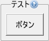

# KFrameLayout

<details>
<summary>凡例</summary>

		var frame = new KFrameLayout(this, %[ 
			name: "frame",
			label: "テスト",
			helpText: "ヘルプも表示できます",
			style: %[
				borderStyle: BORDER_STYLE_SOLID,
				borderWidth: 1,
				borderColor: 0xffacacac,
				borderRadius: 3,
				padding: 2
			]
		]));
		frame(new KTextButton(this, %[ 
			name: "testButton", 
			label: "ボタン" 
		]));

</details>



KFrameLayoutは子の周囲に任意のボーダーを表示するフレームです。

## 親クラス

**KFrameLayout** -> [KLayout](KLayout.md) -> [KEntity](KEntity.md) -> [KWidget](KWidget.md)

## コンストラクタ
```KFrameLayout(window, options = %[])```

### オプション引数(型: 初期値)

- **label** (string: "")
  - フレーム上部に表示されるラベル。
- **helpText** (string: "")
  - ヘルプテキスト  
	設定するとフレーム右上部にヘルプアイコンが表示され、
	マウスオーバーするとヒント形式でヘルプテキストが表示されます。

## プロパティ
- **textAlign** ([Alignment](KDefs.md#alignment) : ALIGN_CENTER)
  - テキストアライメント  
	フレームラベルの表示アライメントを指定します。

## スタイル
- **borderStyle**, **paddingStyle**
  - スタイル指定に基づき、子ウィジェットの周囲にボーダーが描画されます。
- **fontStyle**
  - スタイル指定に基づき、フレームラベルが表示されます。

## メソッド
- **add**(*child*);
  - 子ウィジェットをフレーム内に配置します。
 
- **remove**(*child, doInvalidate = true*);
  - 子ウィジェット*child*を削除します。

	デフォルト動作では削除時に*child*が自動的に無効化されますが、
	*doInvalidate*にfalseを指定することで
	removeした*child*を再利用することができます。
