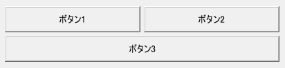

# KGridLayout

<details>
<summary>凡例</summary>

		var gridlayout = new KGridLayout(window,
			%[
				name: "gridlayout",
				style: %[
					space: 5,
					isClass: %[
						KButton: %[
							isVariableWidth: true,
							textAlign: ALIGN_CENTER,
						]
					]
				]
			]
		));
		gridlayout.add(0, 0, new KTextButton(this, %[ name: "textbutton1", label: "ボタン1" ]));
		gridlayout.add(1, 0, new KTextButton(this, %[ name: "textbutton2", label: "ボタン2" ]));
		gridlayout.add(0, 1, new KTextButton(this, %[ name: "textbutton3", label: "ボタン3" ]), 2);

</details>



KGridLayoutは、グリッド上にウィジェットを配置するレイアウトウィジェットです。

## 親クラス

**KGridLayout** -> [KLayout](KLayout.md) -> [KEntity](KEntity.md) -> [KWidget](KWidget.md)

## コンストラクタ
```KGridLayout(window, options = %[])```

## スタイル
- **borderStyle**, **paddingStyle**
  - スタイル指定に基づき、子ウィジェットの周囲にボーダーが描画されます。
- **layoutStyle**
  - スタイル指定に基づき、子ウィジェット間に任意のスペースを挿入します。

## メソッド
- **add**(*x, y, child, colspan = 1, rowspan = 1*);
  - (*x*,*y*) で指定したグリッド座標に子ウィジェット*child*を追加します。
  
	*colspan*, *rowspan* を指定することで、それぞれ横方向、縦方向に
	複数マスのグリッドにまたがる配置を指定できます。

- **remove**(*child, doInvalidate = true*);
  - 指定の子ウィジェット*child*をグリッドから削除します。

	デフォルト動作では削除時に*child*が自動的に無効化されますが、
	*doInvalidate*にfalseを指定することで
	removeした*child*を再利用することができます。
