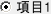

# KRadioButton

<details>
<summary>凡例</summary>

	new KRadioButton(window,
		%[
			label: "項目1",
			choice: 1,
		]
		);

</details>



KRadioButton はラジオボタンのウィジェットです。

機能上は KCheckBox のボタンの見た目が違うだけのバージョンです。

詳細な使い方は [KRadioLayout](KRadioLayout.md) を参照してください。

## 親クラス

**KRadioButton** -> [KCheckBox](KCheckBox.md) -> [KValueEntity](KValueEntity.md) -> [KEntity](KEntity.md) -> [KWidget](KWidget.md)
## コンストラクタ
```KRadioButton(window, options = %[])```

### オプション引数(型: 初期値)
- **choice** (var)
  - このボタンを選択した場合に選ばれる値

