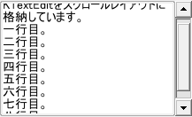

# KScrollLayout

<details>
<summary>凡例</summary>

		var scroll = new KScrollLayout(this, %[
			name: "scroll",
			horizontal: false,
			vertical: true,
			style: %[
				borderColor: 0xffacacac,
				borderStyle: BORDER_STYLE_SOLID,
				borderWidth: 1,
				borderRadius: 3,
				padding: 2
			]
		]);
		scroll.add(new TextEdit(this, %[ name: "textedit" ]));

</details>



KScrollLayoutは、大きな子ウィジェットの任意の範囲だけ表示するようにスクロールさせられるスクロールエリアです。

## 親クラス

**KScrollLayout** -> [KLayout](KLayout.md) -> [KEntity](KEntity.md) -> [KWidget](KWidget.md)

## 内部クラス
- [KButton](KButton.md)
- KRangePointer2D
- KScrollBar
  - KVerticalScrollBar
  - KHorizontalScrollBar

## コンストラクタ
```KScrollLayout(window, options = %[])```

### オプション引数(型: 初期値)

- **horizontal** (bool: true)
  - 水平スクロールバーを有効にするかどうか
- **vertical** (bool: true)
  - 垂直スクロールバーを有効にするかどうか

## プロパティ

- **horizontal** (bool)
  - 水平スクロールバーを有効にするかどうか
- **vertical** (bool)
  - 垂直スクロールバーを有効にするかどうか

## スタイル
- **borderStyle**, **paddingStyle**
  - スタイル指定に基づき、子ウィジェットの周囲にボーダーが描画されます。

## メソッド
- **add**(*child);
  - 子ウィジェットをスクロールエリアに配置します。
- **remove**(*child, doInvalidate = true*);
  - 子ウィジェットをスクロールエリアから削除します。

	デフォルト動作では削除時に*child*が自動的に無効化されますが、
	*doInvalidate*にfalseを指定することで
	removeした*child*を再利用することができます。

