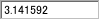

# KTextInput

<details>
<summary>凡例</summary>

	new KTextInput(window,
		%[
			name: "textinput",
			type: TEXT_REAL,
			width: 100,
			height: 20,
			value: 3.141592
		]
		);

</details>



KTextInput は、指定したフォーマットのみ受け付けるテキストフィールドです。

## 親クラス

**KTextInput** -> [KValueEntity](KValueEntity.md) -> [KEntity](KEntity.md) -> [KWidget](KWidget.md)

## 内部クラス

- [KTextEdit](KTextEdit.md)

## コンストラクタ
```KTextInput(window, options = %[])```

### オプション引数(型: 初期値)
- **focusable** (bool: true)
  - フォーカス可能
    trueを指定するとフォーカス可能になります。
- **width** (int)
  - テキストフィールドの幅
- **height** (int)
  - テキストフィールドの高さ。  
    省略するとフォントサイズから自動計算されます。
- **type** (int: TEXT_SYMBOL)
  - テキストタイプ  
	入力を受け付けるテキストのタイプを [TextType](KDefs.md#texttype) で指定します。
- **hideText** (bool: false)
  - テキストを隠すかどうかを指定します。  
  trueに設定すると入力したテキストは「*」の表示でカバーされます。
  パスワードの入力などに使います。
- **respondToValueModification** (bool: false)
  - テキストの更新に反応して毎回 dispatch() を発行するかどうかを設定します。
- **value** (any)
  - 値の初期値

## スタイル
- **borderStyle**, **fontStyle**
  - スタイル指定に基づき、背景がフィルされます
- **texteditId** (string: "textinput_textedit")
  - KTextInput中のテキストフィールドに埋め込まれたKTextEdit のidです  
	テキストフィールドのスタイルは指定したidに対してカスタマイズできます。

## プロパティ
- **hideText** (bool)
  - テキストを隠すかどうか。
- **respondToValueModification** (bool)
  - テキストの更新に反応して毎回 dispatch() を発行するかどうか。
- **value** (string)
  - テキストの値

## フック
- **onEnter**();
  - Enterキーが押されたタイミングで呼び出されます。
- **onCancel**();
  - Escキーが押されたタイミングで呼び出されます。  
