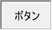

# KTextToggleButton

<details>
<summary>凡例</summary>

	new KTextToggleButton(window,
		%[
			name: "textbutton",
			label: "ボタン",
			value: true,
		]
		);

</details>



KTextToggleButton は、任意のテキストラベルを表示するトグルボタンです。

## 親クラス

**KTextToggleButton** -> [KToggleButton](KToggleButton.md) -> [KValueEntity](KValueEntity.md) -> [KEntity](KEntity.md) -> [KWidget](KWidget.md)

## コンストラクタ
```KTextToggleButton(window, options = %[])```

### オプション引数(型: 初期値)
- **label** (string)
  - テキストラベル  
  ボタンに表示されるテキストラベルを指定します。

## プロパティ
- **label** (string)
  - テキストラベル

## スタイル(型: 初期値)
- **lineSpacing** (int: 0)
  - 行間  
	テキストラベルが改行文字を含む場合の行間サイズを指定します。
- **textAlign** ([Alignment](KDefs.md#alignment) : ALIGN_LEFT)
  - テキストアライメント  
	variableWidth = true 時にテキストを配置するアライメントを指定します。
- **maxLabelWidth** (int: void)
  - ラベルの最大表示幅  
  ラベルの最大表示幅を明示的に指定します。
