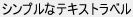
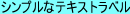
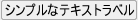

# スタイル

KWidgetではウィジェットの見た目を「スタイル」と言う特別な形式の式でカスタマイズすることができます。

スタイルは様々なプロパティを持った辞書です。

たとえば、 [KTextLabel](KTextLabel.md) にスタイルを適用して次のように見た目を変えることができます。

スタイル指定がない場合

	new KTextLabel(this, 
		%[
			name: "textlabel", 
			label: "シンプルなテキストラベル"
		]
	);

背景色を指定した場合

	new KTextLabel(this, 
		%[
			name: "textlabel", 
			label: "シンプルなテキストラベル"
			style: %[
				backgroundColor: 0xff80ffff
			]
		]
	);

ボーダーを指定した場合

	new KTextLabel(this, 
		%[
			name: "textlabel", 
			label: "シンプルなテキストラベル"
			style: %[
				borderStlye: BORDER_STYLE_SOLID,
				borderColor: 0xffacacac,
				borderWidth: 1,
				borderRadius: 3,
				padding: 2
			]
		]
	);

フォントの装飾を指定した場合

	new KTextLabel(this, 
		%[
			name: "textlabel", 
			label: "シンプルなテキストラベル"
			style: %[
				fontHeight: 20,
				fontBold: true,
				fontAntiAlias: false
			]
		]
	);

## 目次

- [スタイルの指定方法](#スタイルの指定方法)
	- [コンストラクタのオプション引数で指定する](#コンストラクタのオプション引数で指定する)
	- [親のスタイルのクラスプロパティで指定する場合](#親のスタイルのクラスプロパティで指定する場合)
	- [親のスタイルのIDプロパティで指定する場合](#親のスタイルのIDプロパティで指定する場合)
	- [グローバルなスタイルレポジトリのクラススタイルで指定する場合](#グローバルなスタイルレポジトリのクラススタイルで指定する場合)
	- [グローバルなスタイルレポジトリのIDスタイルで指定する場合](#グローバルなスタイルレポジトリのIDスタイルで指定する場合)
	- [スタイルの検索順](#スタイルの検索順)
- [スタイルステート](#スタイルステート)
	- [標準スタイルステートの一覧](#標準スタイルステートの一覧)
	- [カスタムスタイルステート](#カスタムスタイルステート)

## スタイルの指定方法

特定のウィジェットに適用するスタイルは複数の形式で指定することが出来ます。

### コンストラクタのオプション引数で指定する

ウィジェットのオプション引数 **style** で直接指定することが出来ます。

凡例

	new KTextLabel(this, 
		%[
			name: "textlabel", 
			label: "シンプルなテキストラベル"
			style: %[
				backgroundColor: 0xff80ffff
			]
		]

### 親のスタイルのクラスプロパティで指定する場合

**style** 引数の **isClass** プロパティを使うと、
特定のクラスに属する子ウィジェットに適用するスタイルを指定することが出来ます。

凡例

	// 親となるフレームレイアウト
	var frame = new KFrameLayout(window, 
		%[
			type: FRAME_TYPE_SUNKEN,
			style: %[
				// 子の特定のクラスへのスタイル指定
				isClass: %[
					// KTextLabelへのスタイル指定
					KTextLabel: %[
						backgroundColor: 0xff80ffff,
					]
				]
			]
		]
	);
	frame.add(new KTextLabel(this, 
		%[
			name: "textlabel", 
			label: "シンプルなテキストラベル"
		]
	));

### 親のスタイルのIDプロパティで指定する場合

**style** 引数の **isId** プロパティを使うと、
特定のidを持つ子ウィジェットに適用するスタイルを指定することが出来ます。

凡例

	// 親となるフレームレイアウト
	var frame = new KFrameLayout(window, 
		%[
			type: FRAME_TYPE_SUNKEN,
			style: %[
				// 子の特定のidへのスタイル指定
				isId: %[
					// id "colorLabel" へのスタイル指定
					KTextLabel: %[
						backgroundColor: 0xff80ffff,
					]
				]
			]
		]
	);
	frame.add(new KTextLabel(this, 
		%[
			name: "textlabel",
			id: "colorLabel",
			label: "シンプルなテキストラベル"
		]
	));

### グローバルなスタイルレポジトリのクラススタイルで指定する場合

[KStyleRepository](KStyleRepository.md) のインスタンスである
**styleRepository** に対してクラススタイルを登録することで、
特定のクラスに属するウィジェットすべてに
適用するスタイルを指定することが出来ます。

凡例

	// スタイルレポジトリにクラス指定
	styleRepository.overwriteClassStyle
		("KTextLabel",
		%[
			backgroundColor: 0xff80ffff,
		]
		);
	frame.add(new KTextLabel(this, 
		%[
			name: "textlabel",
			label: "シンプルなテキストラベル"
		]
	));

### グローバルなスタイルレポジトリのIDスタイルで指定する場合

[KStyleRepository](KStyleRepository.md) のインスタンスである
**styleRepository** に対してクラススタイルを登録することで、
特定のidを持つウィジェットすべてに
適用するスタイルを指定することが出来ます。

凡例

	// スタイルレポジトリにID指定
	styleRepository.overwriteIdStyle
		("colorLabel",
		%[
			backgroundColor: 0xff80ffff,
		]
		);
	frame.add(new KTextLabel(this, 
		%[
			name: "textlabel",
			id: "colorLabel",
			label: "シンプルなテキストラベル"
		]
	));

### スタイルの検索順

スタイルプロパティは、以下の優先順位で検索されます。

1. 自分自身の **style** 引数
2. 直近の親の **isId** プロパティ
3. 直近の親の **isClass** プロパティ
4. **styleRepository** に登録された idスタイル
4. **styleRepository** に登録された クラススタイル

## スタイルステート

スタイルには、ウィジェットが特定の状態になった時のみ有効化される
**スタイルステート** と呼ばれるプロパティがあります。

たとえば、**hover**ステートを使うと、
ボタンの上にマウスオーバーした時のみ
フォントカラーを変えるといったことができるようになります。

凡例

	new KButton(window,
		%[
			name: "button",
			style: %[
				hover: %[
					fontColor: 0xffff0000,
				]
			]
		]
	);

### 標準スタイルステートの一覧

すべてのウィジェットに共通で以下のスタイルステートが存在します。

- **nodeDisabled**
  - ノードが無効化されている時に有効になる
- **drag**
  - ウィジェットがマウスでドラッグ中に有効になる
- **moseDown**
  - ウィジェットがマウスボタンを押下中に有効になる
- **moseDownLeft**
  - ウィジェットがマウス左ボタンを押下中に有効になる
- **moseDownRight**
  - ウィジェットがマウス右ボタンを押下中に有効になる
- **hover**
  - マウスカーソルがウィジェットをマウスオーバー中に有効になる
- **dragHover**
  - ドラッグ中のマウスカーソルがウィジェットをマウスオーバー中に有効になる
- **focus**
  - ウィジェットがフォーカス中に有効になる
- **descendantHover**
  - マウスカーソルが子孫ウィジェットをマウスオーバー中に有効になる
- **descendantDragHover**
  - ドラッグ中のマウスカーソルが子孫ウィジェットをマウスオーバー中に有効になる
- **descendantFocus**
  - ウィジェットが子孫フォーカス中に有効になる

### カスタムスタイルステート

クラスによっては、そのクラス特有の **カスタムスタイルステート** を持つことがあります。

たとえば、 [KCheckBox](KCheckBox.md) はカスタムスタイルステート
**checkOn** と **checkOff** を持ち、
これによりチェックオン・オフ時のアイコンを個別に指定できるようになっています。

[KWidget](KWidget.md) の
**addCustomStyleState**(), 
**removeCustomStyleState**(), 
**addRemoveCustomStyleState**() メソッドを使って、
自作のウィジェットで任意のカスタムステートを定義することも出来ます。

